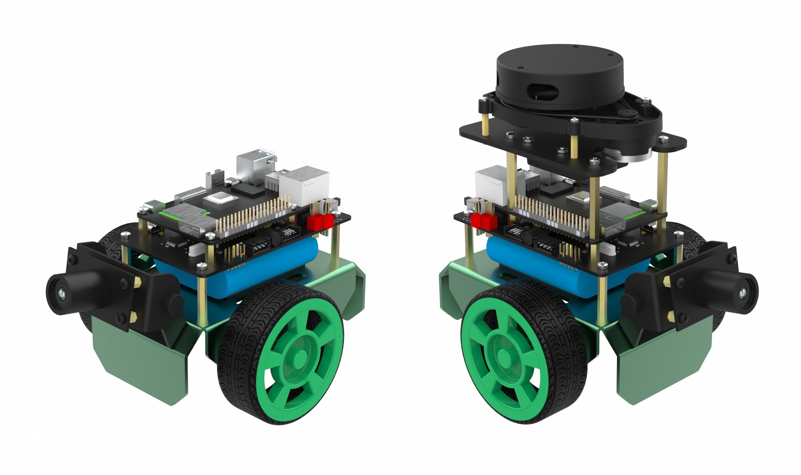
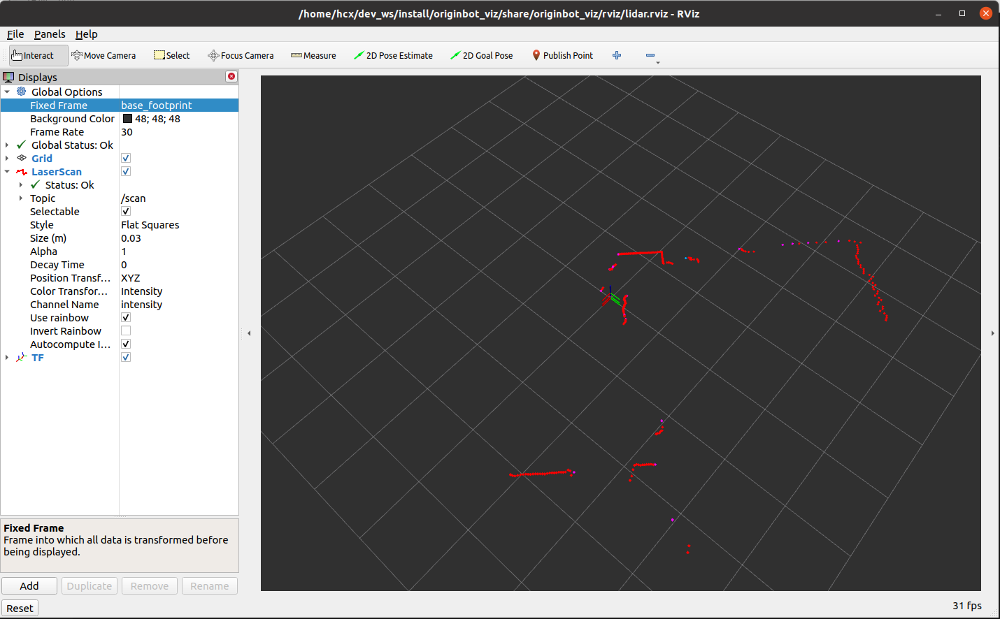
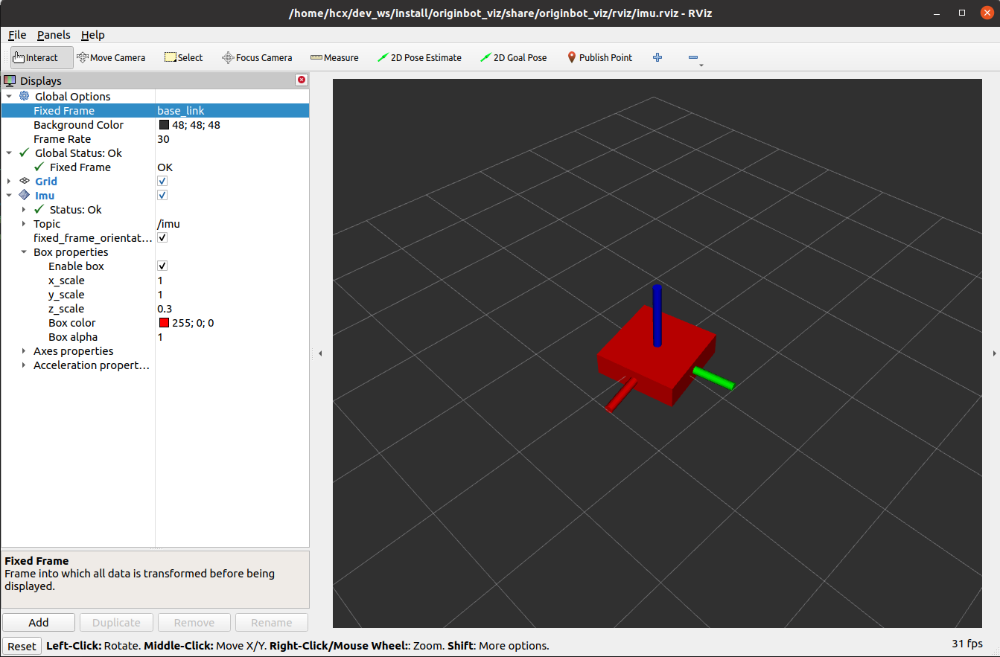
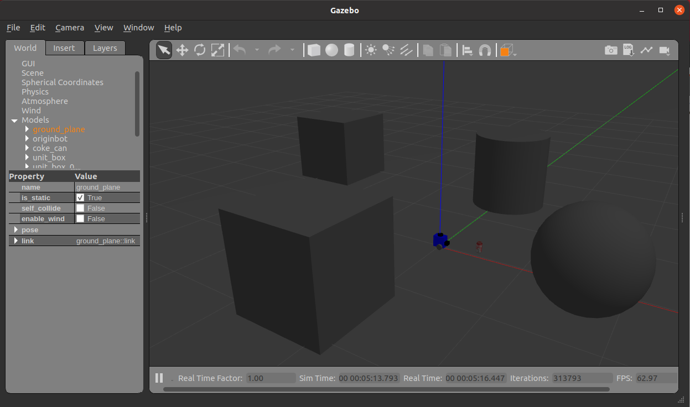

# OriginBot Intelligent Robot Open Source Suite (PC Function Package)


OriginBot is an intelligent robot open-source suite and a community-driven open-source project aimed at enabling every participant to enjoy the fun of robot development.

## Project Links

### Main Site

[https://www.originbot.org/](https://www.originbot.org/)

### Source Code Repositories

| Repository                                                         | Description                     |
| ------------------------------------------------------------------ | ------------------------------- |
| [originbot](https://github.com/yzhcat/originbot)                 | OriginBot robot function package repository |
| [originbot_desktop](https://github.com/yzhcat/originbot_desktop) | OriginBot desktop function package repository |
| [originbot_controller](https://github.com/yzhcat/originbot_controller) | OriginBot controller source code repository |

### Community Forum

[https://guyuehome.com/Bubble/circleDetail/id/95](https://guyuehome.com/Bubble/circleDetail/id/95)

## Software Architecture

- originbot_description: Robot model and loading scripts
- originbot_viz: Robot visualization function package for PC
- originbot_demo: Programming examples for basic robot functions
- originbot_gazebo: Robot simulation models and environments
- originbot_msgs: OriginBot custom communication interfaces
- originbot_app: OriginBot visualization software for PC
- originbot_deeplearning: Robot deep learning function package
    - line_follower_model: AI vision line-following data collection and model training package
    - 10_model_convert: Model conversion scripts

## Quick Start
For detailed instructions, please refer to: [https://www.originbot.org/](https://www.originbot.org/)

### View Robot Visualization Model

#### On PC

```bash
$ ros2 launch originbot_description display.launch.py
```


### View Robot Lidar Visualization Data

```bash
$ ros2 launch originbot_viz display_lidar.launch.py
```

You will see the visualized lidar data:


### View IMU Visualization Data

```bash
$ ros2 launch originbot_viz display_imu.launch.py
```

You will see the visualized IMU data:


### View Robot TF Relationships

```bash
$ ros2 launch originbot_viz display_robot_tf.launch.py
```

### View Robot SLAM Visualization Process

```bash
$ ros2 launch originbot_viz display_slam.launch.py
```

### Monitor Robot Navigation Visualization Process

```bash
$ ros2 launch originbot_viz display_navigation.launch.py
```

### Virtual Simulation

#### PC Dependencies Installation
```bash
$ sudo apt install ros-foxy-gazebo-ros
$ sudo apt install ros-foxy-gazebo-ros2-control
$ sudo apt install ros-foxy-gazebo-plugins
$ sudo apt install ros-foxy-ros2-control
$ sudo apt install ros-foxy-ros2-controllers
```

#### Run Simulation Environment
```bash
$ ros2 launch originbot_gazebo originbot_gazebo.launch.py
```


#### View Simulation Topic List

```bash
$ ros2 topic list
```


#### Control Robot Movement
```bash
$ ros2 run teleop_twist_keyboard teleop_twist_keyboard
```

#### View Camera and Lidar Visualization Data
Place some obstacles in the simulation environment:


```bash
$ ros2 run rviz2 rviz2
```


## Contributing

We sincerely invite developers to participate in the OriginBot project. There are many ways to contribute:

### **Provide Feedback**

- If you encounter any issues or have suggestions while using the OriginBot suite, feel free to discuss them in the [GuyueHome Community Forum](https://guyuehome.com/Bubble/circleDetail/id/95);

- If you find any bugs while using the OriginBot software, please submit an issue in the [code repository](https://github.com/yzhcat/originbot);

### **Contribute Code**

- If you have optimizations, additions, or modifications to the original code while using the OriginBot suite, feel free to submit a Pull Request in the [code repository](https://github.com/yzhcat/originbot);

### **Spread Open Source**

- If you are interested in OriginBot, feel free to star the project's source code repository or share it with developers who might need it;

- If you develop more interesting features or robots based on the OriginBot open-source project, feel free to share them in the [community forum](https://guyuehome.com/Bubble/circleDetail/id/95). Outstanding projects will also be promoted in the community.
